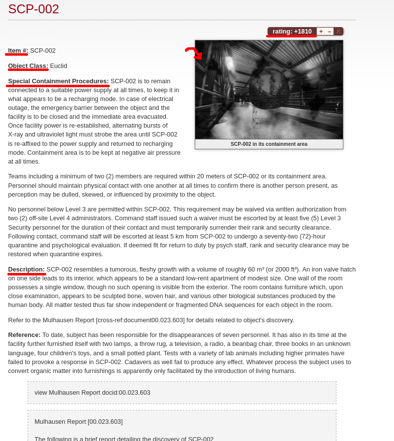
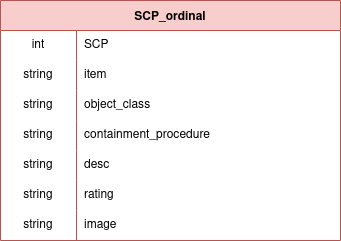

# SCP Web Scrapper
SCP Web Scrapper parse the number of scp with threads and generates a csv file or it can also save it in a sqlite file.

# Why?
This project is aimed to facilitate the access to the SCP foundation archives. For developers and data scientists it will be great to have the scp foundation archives in a easy to access way in order to extract useful information.

# Setup
1. python => 3
2. pip3 install -r requirements.txt
3. python3 main.py

# Database
The file database_manager can be used to save the result in a sql database if the desired output is to be in sqlite.

# Analysis
The scp wiki contains many scp with different styling and very creative ways describe each scp. However there are some similarities with most of the SCPs.

    

There are 6 elements that most of the scp have in common. The SCP number, object class, containment procedure, description, rating, and sometimes they contain an image. With this structure we can get most of the SCPs in a dataframe

    

For easy and fast access to the scp I added a column called SCP (int) which would be the primary key for database and the int representation of the scp .